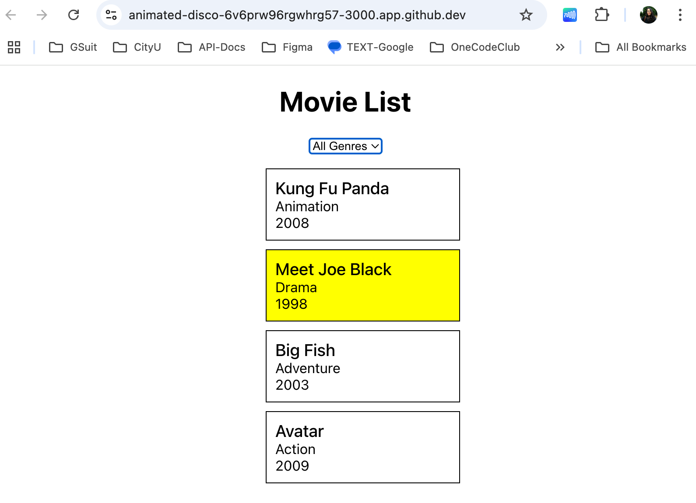

# Movie List

This project is to create a movie list with a drop down menu of genres. The app will render "All Genres" at the initial state. Once a genre is selected from a drop down menu, the movie card will display the selected genre. 

When the cursor is hovered over the card, it will changes color. 

Clicking on the individual movie card will pop-up an alert message informing which movie was selected.

The app doesn't do much. The goal was to practice on creating a React component and managing state. 

## input-process-output model:
1. A requirement from the environment (input)
2. A computation based on the requirement (process)
3. A provision for the environment (output)

### 1. Input
Runs the app in the development mode after creating a React app

Open [http://localhost:3000](http://localhost:3000) to view it in your browser.


### 2. Process
1. Create a Github repo called MovieList
2. Select the code button, from the tab select, Codespaces and then create codespace on main.
3. In the terminal run:
```
npx create-react-app replaceWithAppName
```
4. CD to client directory from terminal and create resume.js and resume.css
5. Add your code. Once satisfied. To start up your app, run:
```
npm start
```
6. Open [http://localhost:3000](http://localhost:3000) to view it in your browser. 

### How to create/use:
[Dropdown Component](https://www.freecodecamp.org/news/build-a-dynamic-dropdown-component/)

[Spread Operator](https://developer.mozilla.org/en-US/docs/Web/JavaScript/Reference/Operators/Spread_syntax)

[Filter() Method](https://developer.mozilla.org/en-US/docs/Web/JavaScript/Reference/Global_Objects/Array/filter)

### 3. Output



