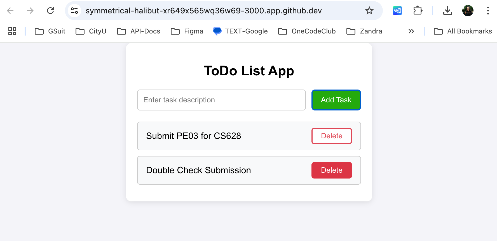
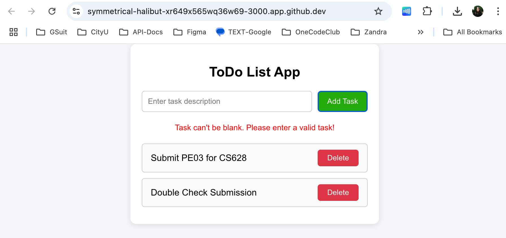

# Movie List

This project is to create a ToDo task list. Users can add a task description and add each task onto the list.  The list can be deleted as the users complete the task. Users can't add a blank task description onto the list. An error message will raise asking user to input a task description before adding task onto the list of tasks. 

There are four components created in this project, the Button, ToDoList, and ToDoTask. 
+**App** - manages the state and provides the core logic of adding and deleting tasks. 
+**ToDoList** - acts as a middle layer, looping through the tasks and rendering each one with a ToDoTask component.
+**ToDoTask** - a child component of ToDoList that focuses solely on displaying a single task and handling its deletion.
+**Button** - for reusability that encapsulates the behavior and styling of buttons used across the app.


Features:
-When the cursor is hovered over the button (add/delete), it will changes color.  

Click on the _Add task_ button without a task description will raise an error message and no blank task will get added onto the list. 

This project assignment can be a component of a larger app, like Task Management, etc. Where the users can add, delete, view or assign tasks to a team, etc. 

## input-process-output model:
1. A requirement from the environment (input)
2. A computation based on the requirement (process)
3. A provision for the environment (output)

### 1. Input
For this project instead of using Codespace, it is run locally on a laptop with a virtual environment to isolate the project dependencies, ensuring that each project can use its own specific versions of packages without conflicts arising from other projects on the system.

Runs the app in the development mode after creating a React app

Open [http://localhost:3000](http://localhost:3000) to view it in your browser.


### 2. Process
1. Inside the root folder, run: 
```
python3 -m venv venv
```
2. Activate the environment:
```
source venv/bin/activate
```
3. Once that's done, create an React app: 
```
npx create-react-app replaceWithAppName
```
4. Now cd to the reactProjectDirect to install packages
```
npm install 
```
5. Once that's done, start up the application:
```
npm start 
```
6. To deactivate the environment, run:
```
deactivate 
```

**The app will render at your local host**
1. Open [http://localhost:3000](http://localhost:3000) to view it in your browser. 

### How to create/use:
[Dropdown Component](https://www.freecodecamp.org/news/build-a-dynamic-dropdown-component/)

[Spread Operator](https://developer.mozilla.org/en-US/docs/Web/JavaScript/Reference/Operators/Spread_syntax)

[Filter() Method](https://developer.mozilla.org/en-US/docs/Web/JavaScript/Reference/Global_Objects/Array/filter)

### 3. Output
**Todo List App**


**Error Message**


