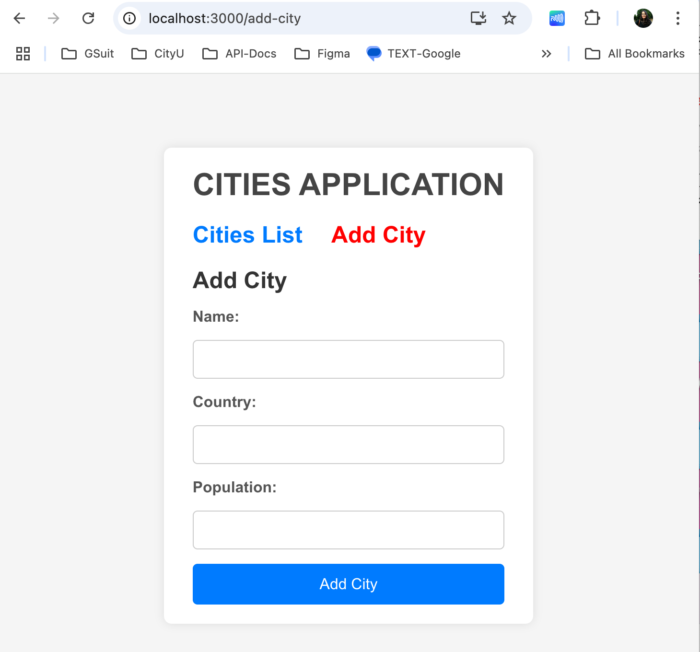
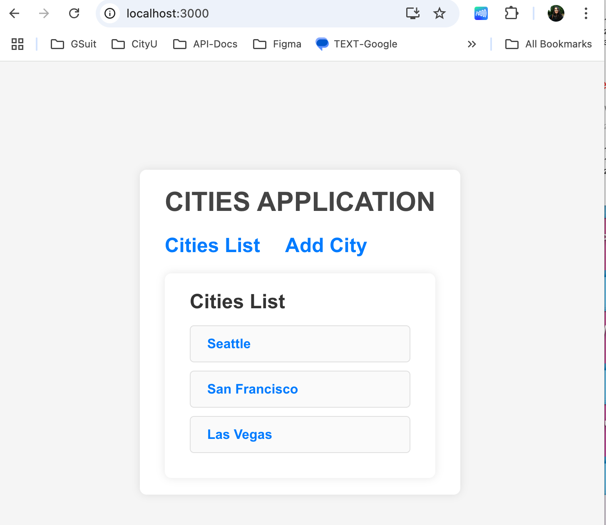
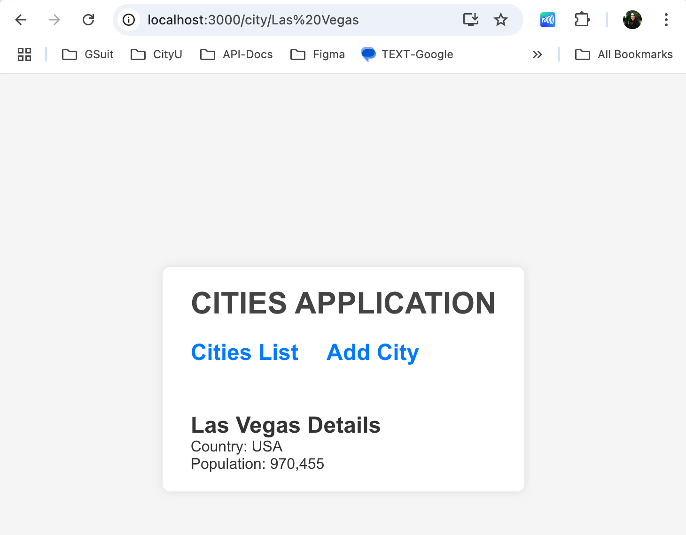
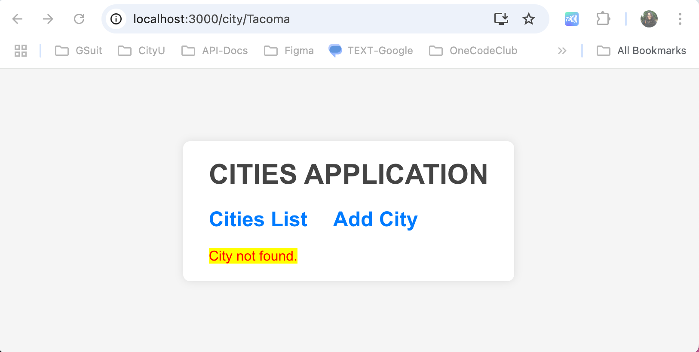

# Cities Application

This project is to create an app for users to add city information onto a list. Here's the application features:

1. **Cities List:** Implement a route that displays a list of cities. Each city in the list should be a clickable link that navigates to the individual city's details page.
2. **Add City:** Implement a route that allows users to add a new city along with its information. The user should be able to provide the city's name, country, population and other details.
3. **City Details:** Implement a nested route under the "Cities List" route that displays detailed information about a specific city. When a user clicks on a city name from the cities list, they should be redirected to the city's details page, where all the information provided about the city is displayed. Utilize the **useParams** hook to fetch and display information based on the city's unique identifier. This city information should be displayed within the same page layout as the "Cities List" page. This means that the city details will replace a designated section of the "Cities List" page's content, while other parts of the layout remain consistent. 
4. **Redirection:** Implement redirection functionality in any one of the screens. For instance, after successfully adding a city, the user should be redirected back to the cities list.

Though the application doesn't need **useParams** because the city details (like /city/Seattle) are shown on the same page without navigating to a new URL. Instead of changing the route, the app can use a state variable (selectedCity) to display details dynamically. However, due to the project requirements. We are going to use **useParam** hook to meet the project requirement. 

**Features:**
1. When hovering over _"Citiies List"_ or _"Add City"_, it will change from blue to red. 
2. Users can click on _"Add City"_ to add city onto the _"Cities List"_
3. List of cities can be view by clicking _"Cities List"_
4. When users visit a city that doesn't exist an error msg will appear. 

**This project assignment can be use as a model for other app. Future consideration for this project could include a delete button to allow user to remove unwanted city from the list to enhance user experience**

## input-process-output model:
1. A requirement from the environment (input)
2. A computation based on the requirement (process)
3. A provision for the environment (output)

### 1. Input
For this project instead of using Codespace, it is run locally on a laptop with a virtual environment to isolate the project dependencies, ensuring that each project can use its own specific versions of packages without conflicts arising from other projects on the system.

Runs the app in the development mode after creating a React app

Open [http://localhost:3000](http://localhost:3000) to view it in your browser.


### 2. Process
1. Inside the root folder, run: 
```
python3 -m venv venv
```
2. Activate the environment:
```
source venv/bin/activate
```
3. Once that's done, create an React app: 
```
npx create-react-app replaceWithAppName
```
4. Now cd to the reactProjectDirect to install packages
```
npm install 
```
5. Once that's done, start up the application:
```
npm start 
```
6. To deactivate the environment, run:
```
deactivate 
```

**The app will render at your local host**
1. Open [http://localhost:3000](http://localhost:3000) to view it in your browser. 

### How to create/use:
[React Router](https://reactrouter.com/home)

[useParams](https://reactrouter.com/6.29.0/hooks/use-params)

[Spread Operator](https://developer.mozilla.org/en-US/docs/Web/JavaScript/Reference/Operators/Spread_syntax)

[Find()](https://developer.mozilla.org/en-US/docs/Web/JavaScript/Reference/Global_Objects/Array/find)

### 3. Output
**Add City**



**City List**



**City Details**



**Error Message**

